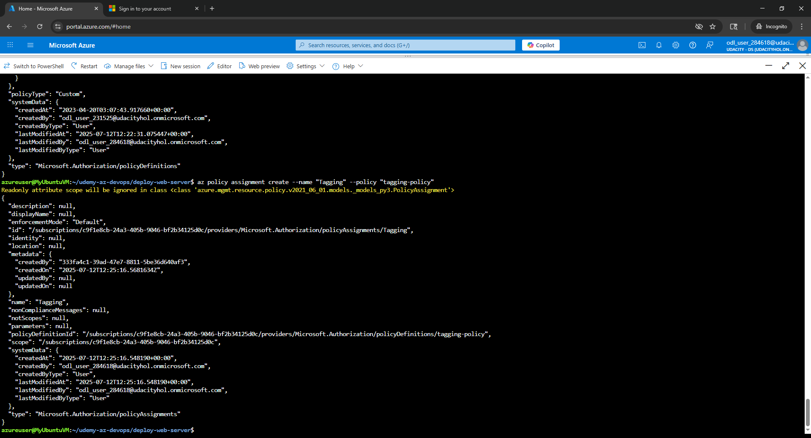

# Azure Infrastructure Operations Project: Deploying a scalable IaaS web server in Azure

## Introduction
For this project, you will write a Packer template and a Terraform template to deploy a customizable, scalable web server in Azure. The original starter files of this project live at this [repository](https://github.com/udacity/nd082-Azure-Cloud-DevOps-Starter-Code/tree/master/C1%20-%20Azure%20Infrastructure%20Operations/project/starter_files).

## Scenario

Your company's development team has created an application that they need deployed to Azure. The application is self-contained, but they need the infrastructure to deploy it in a customizable way based on specifications provided at build time, with an eye toward scaling the application for use in a CI/CD pipeline.

Although we’d like to use Azure App Service, management has told us that the cost is too high for a PaaS like that and wants us to deploy it as pure IaaS so we can control cost. Since they expect this to be a popular service, it should be deployed across multiple virtual machines.

To support this need and minimize future work, we will use Packer to create a server image, and Terraform to create a template for deploying a scalable cluster of servers—with a load balancer to manage the incoming traffic. We’ll also need to adhere to security practices and ensure that our infrastructure is secure.


## Main steps
The project will consist of the following main steps:

1. Creating a Packer template
2. Creating a Terraform template
3. Deploying the infrastructure
4. Creating documentation in the form of a README

## Getting Started
1. Clone this repository
2. Create your infrastructure as code
3. Update this README to reflect how someone would use your code.

### Dependencies
1. Create an [Azure Account](https://portal.azure.com) 
2. Install the [Azure command line interface](https://docs.microsoft.com/en-us/cli/azure/install-azure-cli?view=azure-cli-latest)
3. Install [Packer](https://www.packer.io/downloads)
4. Install [Terraform](https://www.terraform.io/downloads.html)

## Instructions

### 0. Login into Azure CLI using your Azure credentials

```bash
az login
```
 - delete ```terraform.tfstate``` , ```solution.plan``` , ```.terraform.lock.hcl``` artifacts from previous builds

### 1. Deploy a Policy

#### 1.1 Create a custom tagging policy definition based on the json configurations:

Check the policy given in the ```tagging-policy.json``` file. It ensures all indexed resources in your subscription have tags and deny deployment if they do not. Set up this policy with:

```bash
az policy definition create --name "tagging-policy" --description "Ensures all indexed resources in your subscription have tags and deny deployment if they do not." --display-name "tagging-policy" --rules ./tagging-policy.json
```

#### 1.2 Create a policy assignment:

Assign this policy to a tag:

```bash
az policy assignment create --name "Tagging" --policy "tagging-policy"
```

#### 1.3 Verify the creation of the policy

Verify the creation of the policy:

```bash
az policy assignment list
```





### 2. Packer image template
To support application delivery, we need to create an image that different organizations can use to deploy their own apps. To do this, we create a packer image that anyone can use and use it in our own Terraform template.

#### 2.1 Create a Server Image

Things we need to do here are:
- use the templates *main.tf* and *vars.tf* provided
- use Ubuntu 18.04-LTS as a base image
- modify the provisioners according the requirements
- ensure the resource group names in Packer and Terraform are the same
- assign the proper values to environment variables
- place the right variables in *vars.tf* that are being used in *main.tf*

This *server.json* file needs then to be uploaded to a storage in Azure and run via Azure CLI:

```bash
packer build server.json
```

- verify the newly created image by running:

```bash
az image list
```


### 3. Terraform template

#### 3.0 Terraform variables

**Check-out the ```vars.tf``` file!**

There you may need to fill-out with the right values:

- prefix
- client ID
- client secret key
- subscription ID
- tenant ID
- username (admin in VM)
- password  (admin in VM)
- number of VM's (being deployed)
- location (of service provided)

#### 3.1 Initialize Terraform
```bash
terraform init
```

#### 3.2 Review the solution that is up to be deployed
```bash
terraform plan
```

#### 3.3 Save the execution plan to a file *solution.plan*
```bash
terraform plan -out solution.plan
```

#### 3.4 Build and deploy the solution
```bash
terraform apply solution.plan
```

After that, the infrastructure and its resources should be listed here:

```bash
terraform show
```

#### 3.5 Destroy the infrastructure
When not using the infrastructure anymore, we should delete all unused resources:

```bash
terraform destroy
```

It might ask for an prefix in case there are multiple infrastructures deployed. With this prefix, you can identify the resource the resources that are bound to a specific infrastructure as being defined in *vars.tf*.

We should also double-check that all affected infrastructure resources have been deleted successfully:

```bash
terraform show
```


## Output
The Terraform template deploys a virtual network, network security groups, network interfaces, a public IP, a load balancer, availability sets, virtual machines, and managed disks in Azure.

The output of this Terraform template is the deployment of the following Azure resources:

* A virtual network with the specified address space and tags.
* An internal subnet within the virtual network.
* A network security group with inbound rules to allow access to VMs on the same subnet and deny all access from the internet.
* Network interfaces with internal IP configurations.
* A public IP with dynamic allocation.
* A load balancer with a frontend IP configuration linked to the public IP.
* A load balancer backend address pool.
* Association of network interfaces with the load balancer backend address pool.
* An availability set for the virtual machines.
* Virtual machines with the specified configuration, including the specified number of instances, size, OS disk, and network interfaces.
* Managed disks for each virtual machine.

The template uses variables for the Azure credentials, resource group name, prefix, tags, VM count, username, and password.
